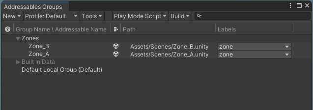

# Snax Games – Unity Home Assignment
  
**Unity:** 2022.3.45f1 LTS (URP)  
**Packages:** Addressables 1.22.3, TextMeshPro, URP  
**Main scene to run:** `Hub.unity`

---

### Overview
The project demonstrates a **Hub** scene that streams two sub-scenes (`Zone_A`, `Zone_B`) using **Unity Addressables** (additive loading/unloading). 

 
When the player approaches a zone, it loads asynchronously; moving away unloads it safely.  
Streaming is handled by the `ZoneStreamer` script.

---

### Controls
| Key | Action |
|------|---------|
| W / ↑ | Move forward |
| S / ↓ | Move backward |
| A / ← | Move left |
| D / → | Move right |

Movement is grid-based and handled by the `PuzzleController`.

---

### Configuration
#### Zones
To adjust zone positions and trigger radii:
- Open `Hub.unity`
- Select the **ZoneStreamer** object  
- Edit:
  - **Center** — zone position in world space  
  - **EnterRadius / ExitRadius** — distance for load/unload triggers  

#### Grid
To change grid size and movement step:
- Select the **PuzzleController** object  
- Edit:
  - **CellSize** — size of one grid step  
  - **MoveSpeed** — movement speed 
  
---

### Implemented Features
- Additive loading via Addressables  
- Safe unloading using `SceneManager.UnloadSceneAsync()`  
- Enter/Exit radius triggers with Gizmo visualization  
- Artificial loading delay (`SimulateSlowLoad`)  
- Fail-guard against overlapping load/unload  
- `[MEM]` logs showing allocated memory & GameObject count per cycle  
- Global baked lighting in Hub + Light Probe Group for dynamic illumination  